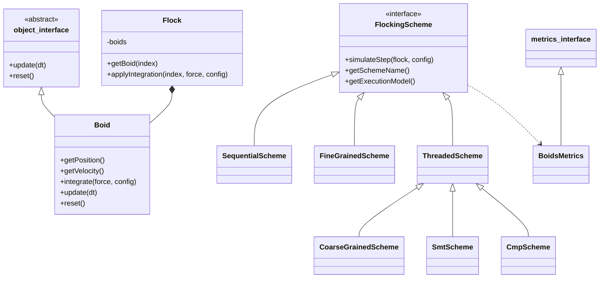
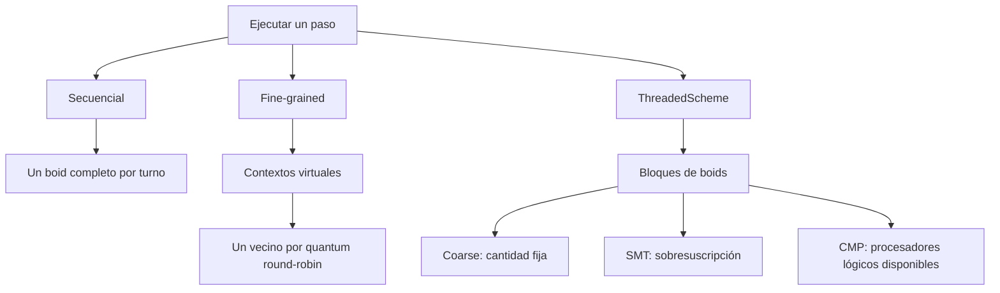

# Demostración 2 — Boids

## Cambios principales desde la Demostración 1

1. El diseño preliminar se convirtió en un sistema secuencial ejecutable.
2. Se separaron cálculo de fuerzas e integración para conservar un estado de
   lectura estable durante cada paso.
3. Se implementaron dummies medibles para fine-grained, coarse-grained, SMT y
   CMP.
4. Se añadieron modalidad gráfica con Raylib y modalidad no gráfica con PPM.
5. `Boid` y `BoidsMetrics` se alinearon con las interfaces de `shared`.
6. Se añadieron validaciones automáticas contra el resultado secuencial.

## Diagrama de clases

## Flujo común de un paso

La separación evita que un boid lea la posición ya actualizada de otro durante
el mismo paso. Los hilos escriben solamente en rangos distintos del vector
temporal de fuerzas.

## Diferencia entre los esquemas preliminares

- Fine-grained es una simulación cooperativa y parcial. No crea hilos del SO.
- Coarse-grained crea hilos tradicionales y espera en `join()`.
- SMT aproxima contención mediante sobresuscripción.
- CMP ejecuta hilos en paralelo, pero C++ no distingue núcleos físicos de
  hilos SMT mediante `hardware_concurrency()`.

## Variables importantes

| Variable | Efecto |
|---|---|
| `boidCount` | Aumenta el trabajo cuadrático de búsqueda de vecinos |
| `perceptionRadius` | Cambia cuántos vecinos contribuyen al cálculo |
| `separationRadius` | Cambia el trabajo efectivo de separación |
| Densidad espacial | Produce distinta cantidad de vecinos activos por boid |
| Trabajadores | Cambia partición, creación de hilos y sincronización |
| Pesos de reglas | Cambian la dinámica visual, no la complejidad asintótica |

## Requisito y evidencia

| Requisito de Demo 2 | Evidencia |
|---|---|
| Diagramas preliminares | Diagramas de este documento |
| Cambios significativos | Lista inicial y separación por estrategias |
| Sistema base sin hilos | `SequentialScheme` y `boids_visual` |
| Variables de paralelización | Tabla anterior y `FlockingConfig` |
| Dummy fine | `FineGrainedScheme`, validado sobre su subconjunto |
| Dummy coarse | `CoarseGrainedScheme`, validado contra todo el baseline |
| Dummy SMT | `SmtScheme`, validado contra todo el baseline |
| Dummy CMP | `CmpScheme`, validado contra todo el baseline |
| Mediciones | Tabla producida por `boids_benchmark` |
| Modalidad no gráfica | Benchmark y frames PPM |
| Modalidad gráfica | Ejecutable opcional `boids_visual` |

## Guion corto para la ejecución

1. Compilar en Release y ejecutar `ctest`.
2. Ejecutar `boids_benchmark`.
3. Señalar la cantidad y el tipo de trabajadores de cada fila.
4. Mostrar las cuatro validaciones exitosas.
5. Mostrar los PPM convertidos a video o ejecutar `boids_visual`.
6. Cambiar `boidCount` o la cantidad coarse para explicar escalabilidad.

Las cifras de esta demostración prueban funcionalidad, no significancia
estadística. La campaña final debe realizar al menos 200 ejecuciones por caso,
calcular intervalos de confianza y perfilar directamente sobre hardware físico.
