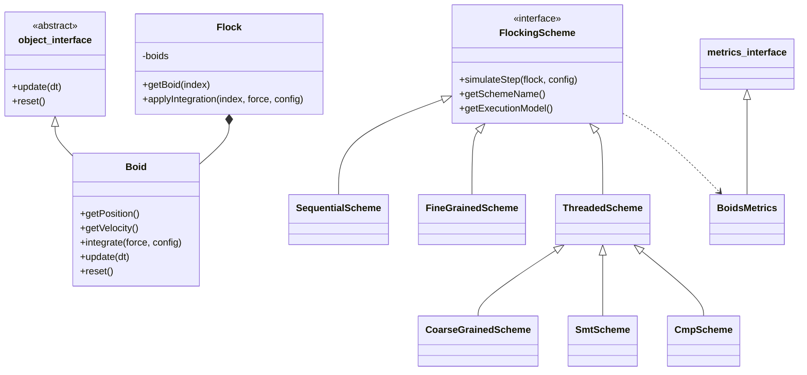
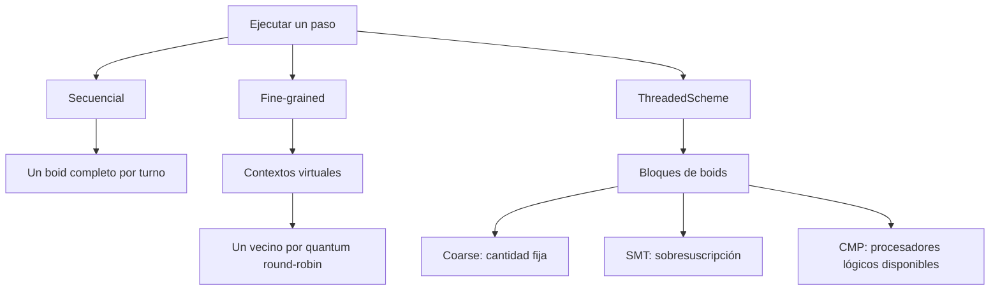
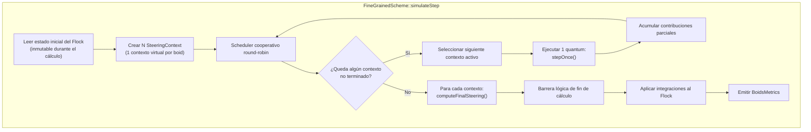
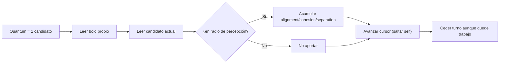
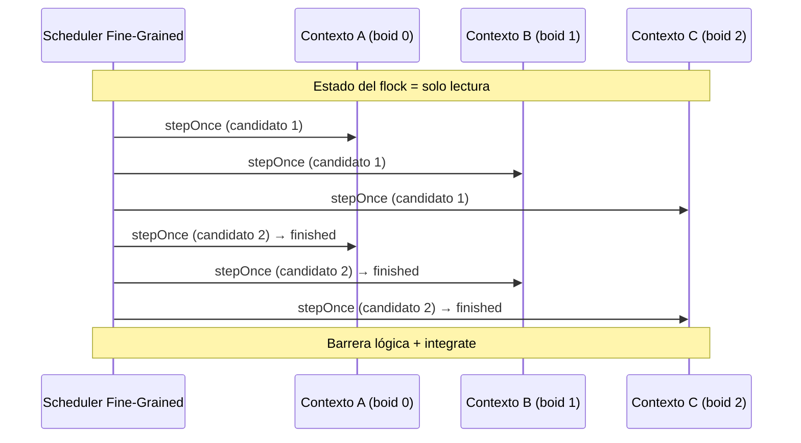
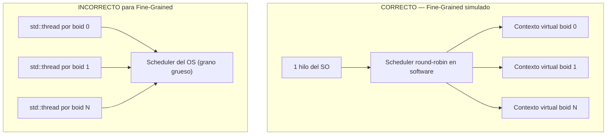
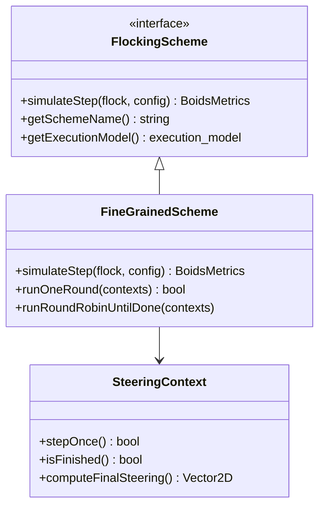

# Demostración 2 — Boids

## Cambios principales desde la Demostración 1

1. El diseño preliminar se convirtió en un sistema secuencial ejecutable.
2. Se separaron cálculo de fuerzas e integración para conservar un estado de
   lectura estable durante cada paso.
3. Se implementaron dummies medibles para coarse-grained, SMT y CMP, y un
   Fine-Grained completo (simulación cooperativa, no dummy de hilos).
4. Se añadieron modalidad gráfica con Raylib y modalidad no gráfica con PPM.
5. `Boid` y `BoidsMetrics` se alinearon con las interfaces de `shared`.
6. Se añadieron validaciones automáticas contra el resultado secuencial.

## Diagrama de clases


```mermaid
classDiagram
    class object_interface {
        <<abstract>>
        +update(dt)
        +reset()
    }
    class Boid {
        +getPosition()
        +getVelocity()
        +integrate(force, config)
        +update(dt)
        +reset()
    }
    class Flock {
        -boids
        +getBoid(index)
        +applyIntegration(index, force, config)
    }
    class FlockingScheme {
        <<interface>>
        +simulateStep(flock, config)
        +getSchemeName()
        +getExecutionModel()
    }
    class SequentialScheme
    class FineGrainedScheme
    class ThreadedScheme
    class CoarseGrainedScheme
    class SmtScheme
    class CmpScheme
    class metrics_interface
    class BoidsMetrics

    object_interface <|-- Boid
    Flock *-- Boid
    FlockingScheme <|-- SequentialScheme
    FlockingScheme <|-- FineGrainedScheme
    FlockingScheme <|-- ThreadedScheme
    ThreadedScheme <|-- CoarseGrainedScheme
    ThreadedScheme <|-- SmtScheme
    ThreadedScheme <|-- CmpScheme
    metrics_interface <|-- BoidsMetrics
    FlockingScheme ..> BoidsMetrics
```

## Flujo común de un paso


```mermaid
flowchart LR
    initialState["Estado inicial inmutable"] --> forcePhase["Calcular fuerzas"]
    forcePhase --> barrier["Barrera del esquema"]
    barrier --> integrationPhase["Integrar todos los boids"]
    integrationPhase --> finalState["Estado final"]
```

La separación evita que un boid lea la posición ya actualizada de otro durante
el mismo paso. Los hilos escriben solamente en rangos distintos del vector
temporal de fuerzas.

## Diferencia entre los esquemas preliminares


```mermaid
flowchart TB
    request["Ejecutar un paso"] --> sequential[Secuencial]
    request --> fine["Fine-grained"]
    request --> threaded[ThreadedScheme]

    sequential --> seqLoop["Un boid completo por turno"]
    fine --> contexts["Contextos virtuales"]
    contexts --> roundRobin["Un vecino por quantum round-robin"]
    threaded --> blocks["Bloques de boids"]
    blocks --> coarse["Coarse: cantidad fija"]
    blocks --> smt["SMT: sobresuscripción"]
    blocks --> cmp["CMP: procesadores lógicos disponibles"]
```

- Fine-grained es una **simulación cooperativa** en un solo hilo del SO. No
  crea `std::thread`. Cada boid es un contexto virtual; el quantum es un
  vecino candidato; el scheduler es round-robin aunque el contexto actual no
  haya terminado. Sirve para contrastar el modelo y medir overhead, no speedup.
- Coarse-grained crea hilos tradicionales y espera en `join()`. Puede inyectar
  stalls didácticos solo tras terminar un boid completo, con
  checkpoint manual explícito frente al save implícito del SO. Ver
  [coarse-grained.md](coarse-grained.md).
- SMT aproxima contención mediante sobresuscripción.
- CMP ejecuta hilos en paralelo, pero C++ no distingue núcleos físicos de
  hilos SMT mediante `hardware_concurrency()`.

## Variables importantes

| Variable | Efecto |
|---|---|
| `boidCount` | Aumenta el trabajo cuadrático de búsqueda de vecinos |
| `perceptionRadius` | Cambia cuántos vecinos contribuyen al cálculo |
| `separationRadius` | Cambia el trabajo efectivo de separación |
| Densidad espacial | Produce distinta cantidad de vecinos activos por boid |
| Trabajadores | Cambia partición, creación de hilos y sincronización |
| Pesos de reglas | Cambian la dinámica visual, no la complejidad asintótica |

## Requisito y evidencia

| Requisito de Demo 2 | Evidencia |
|---|---|
| Diagramas preliminares | Diagramas de este documento |
| Cambios significativos | Lista inicial y separación por estrategias |
| Sistema base sin hilos | `SequentialScheme` (`boids --scheme sequential`) |
| Variables de paralelización | Tabla anterior, `FlockingConfig` y flags CLI |
| Dummy fine | `FineGrainedScheme` (`--scheme fine`), flock completo o `--partial N` |
| Dummy coarse | `CoarseGrainedScheme`, validado contra todo el baseline |
| Dummy SMT | `SmtScheme`, validado contra todo el baseline |
| Dummy CMP | `CmpScheme`, validado contra todo el baseline |
| Mediciones | Tabla de `boids --scheme compare` |
| Modalidad no gráfica | `boids --no-gui` y frames PPM |
| Modalidad gráfica | `boids --gui` (mismo ejecutable) |

## Guion corto para la ejecución

Scripts de setup y demo (instalan deps y PATH si faltan):

- Windows: `proyect_1-Multithreading/scripts/setup_windows.ps1` y `run_demo2.ps1`
- Linux: `proyect_1-Multithreading/scripts/setup_linux.sh` y `run_demo2.sh`

Para la defensa de Demo 2:

```powershell
.\proyect_1-Multithreading\scripts\run_demo2.ps1 -Mode all
```

```bash
./proyect_1-Multithreading/scripts/run_demo2.sh all
```

1. Compilar en Release y ejecutar `ctest`.
2. Ejecutar `boids --scheme compare` (sin UI: secuencial + dummies + frames).
3. Señalar la cantidad y el tipo de trabajadores de cada fila.
4. Mostrar las cuatro validaciones exitosas.
5. Mostrar los PPM o `boids --scheme sequential --gui` / `boids --scheme cmp --gui`.
6. Cambiar `--boids` o `--workers` para explicar escalabilidad.

Las cifras de esta demostración prueban funcionalidad, no significancia
estadística. La campaña final debe realizar al menos 200 ejecuciones por caso,
calcular intervalos de confianza y perfilar directamente sobre hardware físico.

## Fine-Grained — modelo, flujo y defensa

Fine-Grained en hardware real es un mecanismo **microarquitectónico**. El
planificador del SO no cambia de contexto en cada ciclo, por eso este esquema
**simula** N hilos lógicos dentro de **un** hilo del SO.

### Flujo de un paso


```mermaid
flowchart TB
    subgraph paso["FineGrainedScheme::simulateStep"]
        A["Leer estado inicial del Flock<br/>(inmutable durante el cálculo)"] --> B["Crear N SteeringContext<br/>(1 contexto virtual por boid)"]
        B --> C["Scheduler cooperativo round-robin"]
        C --> D{"¿Queda algún contexto<br/>no terminado?"}
        D -->|Sí| E["Seleccionar siguiente contexto activo"]
        E --> F["Ejecutar 1 quantum:<br/>stepOnce()"]
        F --> G["Acumular contribuciones parciales"]
        G --> C
        D -->|No| H["Para cada contexto:<br/>computeFinalSteering()"]
        H --> I["Barrera lógica de fin de cálculo"]
        I --> J["Aplicar integraciones al Flock"]
        J --> K["Emitir BoidsMetrics"]
    end
```

### Quantum mínimo


```mermaid
flowchart LR
    Q["Quantum = 1 candidato"] --> R["Leer boid propio"]
    R --> S["Leer candidato actual"]
    S --> T{"¿en radio de percepción?"}
    T -->|Sí| U["Acumular alignment/cohesion/separation"]
    T -->|No| V["No aportar"]
    U --> W["Avanzar cursor (saltar self)"]
    V --> W
    W --> X["Ceder turno aunque quede trabajo"]
```

### Timeline round-robin (3 boids)


```mermaid
sequenceDiagram
    participant Sch as Scheduler Fine-Grained
    participant A as Contexto A (boid 0)
    participant B as Contexto B (boid 1)
    participant C as Contexto C (boid 2)

    Note over Sch,C: Estado del flock = solo lectura
    Sch->>A: stepOnce (candidato 1)
    Sch->>B: stepOnce (candidato 1)
    Sch->>C: stepOnce (candidato 1)
    Sch->>A: stepOnce (candidato 2) → finished
    Sch->>B: stepOnce (candidato 2) → finished
    Sch->>C: stepOnce (candidato 2) → finished
    Note over Sch,C: Barrera lógica + integrate
```

### Contraste correcto vs incorrecto


```mermaid
flowchart TB
    subgraph correcto["CORRECTO — Fine-Grained simulado"]
        OS1["1 hilo del SO"] --> SCH["Scheduler round-robin en software"]
        SCH --> V0["Contexto virtual boid 0"]
        SCH --> V1["Contexto virtual boid 1"]
        SCH --> VN["Contexto virtual boid N"]
    end

    subgraph incorrecto["INCORRECTO para Fine-Grained"]
        T0["std::thread por boid 0"]
        T1["std::thread por boid 1"]
        TN["std::thread por boid N"]
        OSS["Scheduler del OS (grano grueso)"]
        T0 --> OSS
        T1 --> OSS
        TN --> OSS
    end
```

### Clases del esquema


```mermaid
classDiagram
    class FlockingScheme {
        <<interface>>
        +simulateStep(flock, config) BoidsMetrics
        +getSchemeName() string
        +getExecutionModel() execution_model
    }
    class FineGrainedScheme {
        +simulateStep(flock, config) BoidsMetrics
        +runOneRound(contexts) bool
        +runRoundRobinUntilDone(contexts)
    }
    class SteeringContext {
        +stepOnce() bool
        +isFinished() bool
        +computeFinalSteering() Vector2D
    }
    FlockingScheme <|-- FineGrainedScheme
    FineGrainedScheme --> SteeringContext
```

### Guion corto de defensa

1. El enunciado exige Fine-Grained por **simulación de cuantums**, no por hilos del SO.
2. En Boids, cada boid es un **contexto virtual** (`SteeringContext`).
3. Un quantum = revisar **un vecino** (`stepOnce`).
4. El scheduler hace **round-robin** aunque el contexto actual no haya terminado.
5. Al final se integra, igual que el baseline, para preservar correctitud.
6. En benchmarks, Fine muestra **el modelo y su overhead**; coarse/SMT/CMP
   muestran paralelismo real o aproximado.

Variables que encarecen Fine: `boidCount` (O(N²) más el costo del scheduler),
radios de percepción/separación, y `--partial` (cantidad de contextos).
`boids --scheme fine` usa el flock completo; `--partial N` acota demos.
