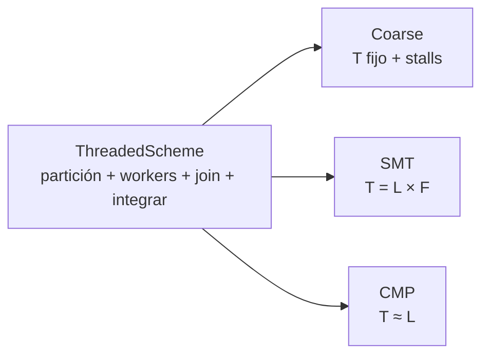
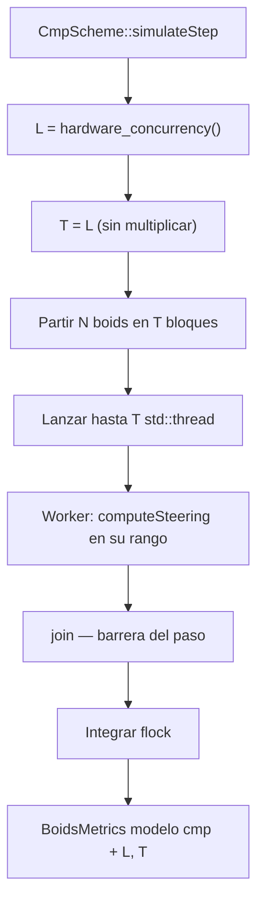
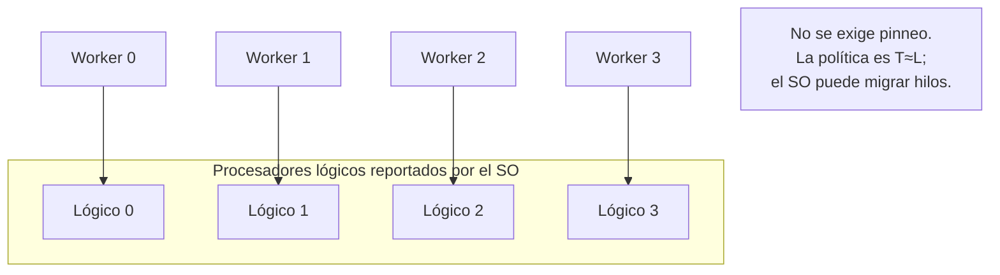
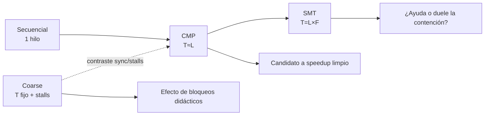

# Multiprocesamiento multinúcleo (CMP) — Boids (BOIDS-CMP-001)

Implementación **directa** de CMP del enunciado: paralelismo real con hilos
del SO y política canónica `T = L = hardware_concurrency()`, sobre la
orquestación común de `ThreadedScheme`. No sobresuscribe (SMT) ni fija `T`
por `--workers` (Coarse).

## Mapeo teoría → Boids

| Concepto CMP | Implementación |
|---|---|
| Chip con múltiples núcleos | Máquina multinúcleo / multiprocesador lógico |
| Paralelismo real | Varios `std::thread` en paralelo |
| Mapear trabajo a hardware | `T = max(1, hardware_concurrency())` |
| Partición del problema | Bloques de boids `[start, end)` |
| Sin sobre-suscripción deliberada | No multiplicar `L` por un factor |
| Sincronización de paso | `join()` + integración |
| Interfaz del framework | `FlockingScheme` / `ThreadedScheme` |

## Política de hilos (Coarse vs SMT vs CMP)

| Aspecto | Coarse | SMT | CMP |
|---|---|---|---|
| Cómo se elige `T` | Fijo (`--workers`) | `L × F` (`--oversubscribe`) | `T ≈ L` |
| Historia principal | Bloqueo costoso + stalls | Contención / recursos compartidos | Capacidad multinúcleo |
| Checkpoint manual | Sí (didáctico) | No | No |
| Barrido manual de T | Sí (`--workers`) | Vía `F` | No (canónico = automático) |



## Flujo de un paso



## Idea “un hilo por unidad de hardware visible”



## Dónde encaja experimentalmente



## CLI

```text
boids --scheme cmp
      [--boids N] [--steps N|--forever] [--seed S]
      [--perception R] [--separation R] ...
      [--gui|--no-gui] [--validate]
```

`T` es **automático** (`T = L`). El barrido típico es el tamaño del problema
(`--boids`, `--steps`), no la cantidad de hilos.

Ejemplos:

```bash
# Medición headless (default de campaña)
boids --scheme cmp --validate --boids 120 --steps 1

# Barrido de N
boids --scheme cmp --no-gui --boids 50 --steps 50
boids --scheme cmp --no-gui --boids 200 --steps 50
boids --scheme cmp --no-gui --boids 500 --steps 50

# Demo visual (misma semántica)
boids --scheme cmp --gui --boids 300

# Compare incluye CMP
boids --scheme compare
```

Métricas de consola (modelo `cmp`): `L` (lógicos detectados) y `T` (workers
efectivos; puede ser `< L` si hay más hilos que boids).

## Lógicos vs físicos + BIOS SMT

| Estado BIOS | Qué suele reportar `L` | Cómo leer CMP |
|---|---|---|
| SMT/HT **ON** | Lógicos ≈ 2× físicos (típico) | CMP ya puede usar hilos HT |
| SMT/HT **OFF** | Lógicos ≈ físicos | CMP se interpreta más “limpio” |

> Las mediciones principales deben hacerse en **hardware físico** (no
> WSL/VM/contenedor). El contraste capacidad vs contención es
> **CMP (`T=L`) vs SMT (`T=L×F`)** con el mismo `N`.

## Limitaciones a declarar en defensa

1. `hardware_concurrency()` reporta **lógicos**, no físicos.
2. Con BIOS SMT/HT ON, CMP puede estar usando ya hilos SMT de hardware.
3. Con BIOS OFF, `L` se acerca más a núcleos físicos.
4. No se exige affinity: el SO puede migrar hilos entre núcleos.
5. No se usa `--workers` como definición de CMP (eso es Coarse).
6. Campaña estadística final (200+ corridas) queda fuera de este ticket;
   el modelo queda listo para medir.

## Guion corto de defensa

1. CMP es paralelismo real multinúcleo con hilos del SO.
2. Lanzamos `T ≈ hardware_concurrency()`: un hilo por procesador lógico.
3. No sobresuscribimos (SMT) ni fijamos T a mano (Coarse).
4. Reutilizamos `ThreadedScheme`; CMP solo define cuántos hilos hay.
5. Medimos speedup en headless; GUI solo demuestra el mismo esquema.
6. Al leer resultados, recordamos que `L` puede incluir HT si el BIOS trae SMT ON.

## Script de barrido

Ver [`../../scripts/sweep_cmp_boids.sh`](../../scripts/sweep_cmp_boids.sh)
(y el `.ps1` equivalente) para barrer `--boids` sobre `--scheme cmp`
sin recompilar.
