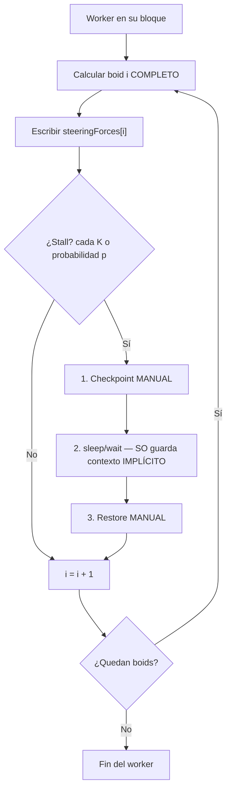
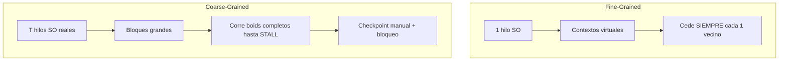

# Coarse-Grained Multithreading — Boids (BOIDS-CG-001)

Implementación directa con hilos reales del SO. El cambio de contexto observable
se asocia a **bloqueos costosos** (stalls didácticos inyectados y `join()`), no a
round-robin por quantum (eso es Fine-Grained).

## Mapeo teoría → Boids

| Concepto | Implementación |
|---|---|
| Hilo tradicional | `std::thread` |
| Trabajo de grano grueso | Bloque `[start, end)` de boids |
| Stall / bloqueo costoso | `sleep_for` inyectado + `join()` final |
| Contexto real (SO) | Stack/PCB preservados **implícitamente** al bloquear |
| Contexto didáctico | `CoarseWorkerCheckpoint` guardado/restaurado **manualmente** |
| Unidad que no se parte | Un boid completo |

## stall en frontera de boid



## Fine vs Coarse



## Frase clave para defensa

> En un sistema real, al bloquearse el hilo el sistema operativo conserva
> automáticamente su contexto (stack, registros, PCB). Este checkpoint manual
> no sustituye ese mecanismo: lo **hace visible** para demostración académica
> del save/resume ante un stall costoso.

## CLI

```text
boids --scheme coarse
      [--workers T]
      [--stall-every K]
      [--stall-probability P]
      [--stall-ms X]
      [--stall-ms-min A --stall-ms-max B]
      [--log-checkpoints]
      [--boids N] [--steps N|--forever] [--seed S]
      [--gui|--no-gui] [--validate]
```

- **Sin stalls** (`--stall-every 0` y probabilidad 0): baseline de speedup coarse.
- **Con stalls**: demo académica; el resultado numérico sigue siendo equivalente al secuencial.
- Disparo: `(cada K) OR (sorteo P)`. Duración: rango min/max si ambos se pasan; si no, `--stall-ms`.

## Ejemplos

```bash
# Speedup sin stalls didácticos
boids --scheme coarse --workers 4 --boids 200 --steps 100 --validate

# Demo con stalls observables + traza de checkpoint
boids --scheme coarse --workers 2 --stall-every 5 --stall-ms 10 --log-checkpoints --boids 40 --steps 1

# Stall aleatorio reproducible
boids --scheme coarse --stall-probability 0.2 --stall-ms-min 1 --stall-ms-max 5 --seed 7 --validate
```
