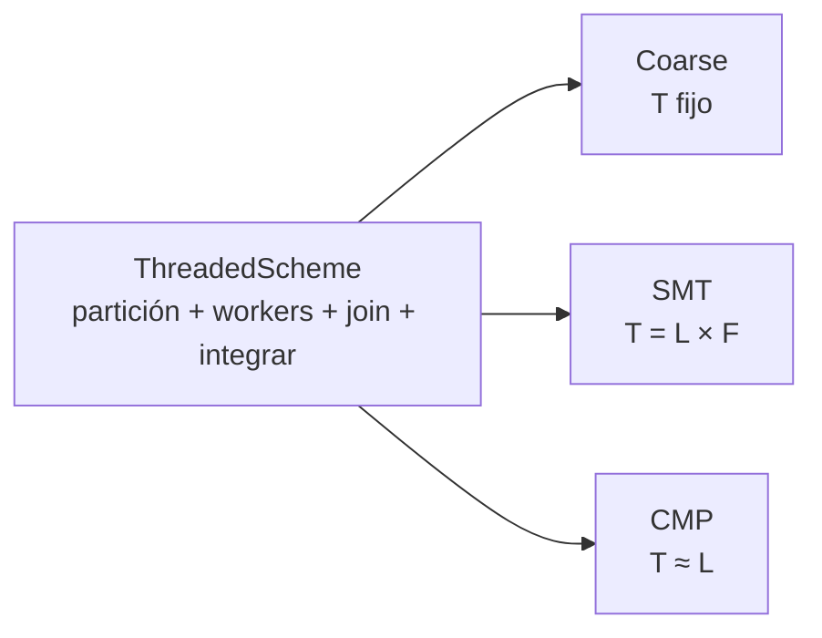
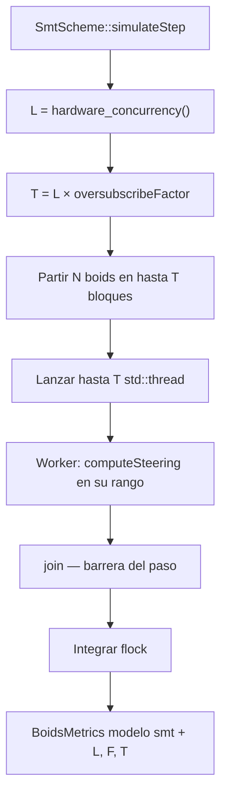
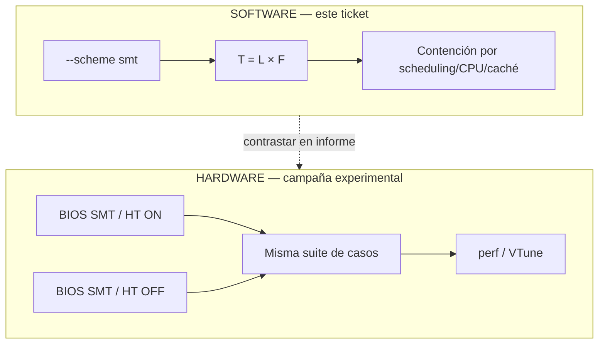

# Multihilo simultáneo (SMT) — Boids (BOIDS-SMT-001)

Aproximación por **software** del SMT del enunciado: sobre-suscripción
parametrizable de hilos (`T = L × F`) sobre la orquestación común de
`ThreadedScheme`. **No implementa Hyper-Threading**; el contraste con SMT
real de hardware es el experimento BIOS/UEFI ON vs OFF + perfilado.

## Mapeo teoría → Boids

| Concepto SMT | Implementación |
|---|---|
| Hilos lógicos compitiendo | Varios `std::thread` activos |
| Sobre-suscripción | `T = hardware_concurrency() × --oversubscribe` |
| Recursos compartidos | CPU time, caché, scheduling del SO |
| Unidad de trabajo | Bloque de boids `[start, end)` |
| Sincronización de paso | `join()` + integración posterior |
| SMT hardware real | BIOS ON/OFF + `perf` / VTune (fuera del algoritmo) |

## Política de hilos (Coarse vs SMT vs CMP)

| Aspecto | Coarse | SMT | CMP |
|---|---|---|---|
| Cómo se elige `T` | Fijo (`--workers`) | `L × F` (`--oversubscribe`) | `T ≈ L` |
| Historia principal | Bloqueo costoso + stalls | Contención / compartir recursos | 1 hilo por lógico |
| Checkpoint manual | Sí (didáctico) | No | No |
| Relación con hardware | Independiente de `L` | Depende de `L` y `F` | Depende de `L` |



## Flujo de un paso



## Software vs experimento hardware



## CLI

```text
boids --scheme smt
      [--oversubscribe F]          # default 2; mínimo 1
      [--boids N] [--steps N|--forever] [--seed S]
      [--gui|--no-gui] [--validate]
```

Ejemplos:

```bash
# Medición headless (default de campaña)
boids --scheme smt --oversubscribe 2 --validate --boids 120 --steps 1

# Barrido de factor
boids --scheme smt --oversubscribe 1 --no-gui --boids 200 --steps 50
boids --scheme smt --oversubscribe 4 --no-gui --boids 200 --steps 50

# Demo visual (misma semántica)
boids --scheme smt --gui --oversubscribe 2

# Compare incluye SMT
boids --scheme compare
```

Métricas de consola (modelo `smt`): `L` (lógicos), `F` (factor), `T` (workers
efectivos; puede ser `< L×F` si hay más hilos que boids).

## Checklist experimental BIOS + perfilado

> Procedimiento de laboratorio (manual). No se automatiza desde el binario.

### Preparación común

1. Usar **hardware físico** (no WSL/VM/contenedor para mediciones principales).
2. Fijar suite: mismos `--boids`, `--steps`, `--seed`, radios/pesos.
3. Compilar Release; preferir `--no-gui` para benchmarks.
4. Anotar modelo de CPU y si Hyper-Threading / SMT aparece en el SO.

### A. SMT / HT habilitado (BIOS ON)

1. BIOS/UEFI: Hyper-Threading (Intel) o SMT (AMD) **Enabled**.
2. Reiniciar; verificar lógicos (p. ej. `lscpu`, Administrador de tareas).
3. Correr suite: sequential, cmp, `smt --oversubscribe 1`, `smt --oversubscribe 2`,
   `smt --oversubscribe 4` (y coarse/fine si aplica al informe).
4. Perfilar al menos una corrida SMT y una CMP con `perf` o VTune.

### B. SMT / HT deshabilitado (BIOS OFF)

1. BIOS/UEFI: Hyper-Threading / SMT **Disabled**.
2. Reiniciar; verificar que `L` bajó (típicamente ~mitad si había 2 hilos/núcleo).
3. Repetir **exactamente** la misma suite y los mismos scripts de perfilado.
4. Comparar wall time, workers, stalls de pipeline / uso por hilo lógico.

### C. Herramientas sugeridas

**Linux `perf` (ejemplo orientativo):**

```bash
perf stat -e cycles,instructions,cache-misses,context-switches \
  ./build/boids/boids --scheme smt --oversubscribe 2 --boids 200 --steps 100 --no-gui
```

**Intel VTune:** análisis de threading / microarquitectura sobre el mismo
comando headless; exportar resumen de CPU time por hilo y stalls.

### D. Limitaciones a declarar en defensa

1. `hardware_concurrency()` reporta **lógicos**, no físicos.
2. Con BIOS ON, `L` ya incluye HT; `F=2` sobresuscribe aún más.
3. Por eso el enunciado exige BIOS ON vs OFF.
4. La aproximación software muestra contención/scheduling; no replica issue
   slots ni ALUs compartidas ciclo a ciclo.
5. Software ≠ Hyper-Threading real; se contrastan, no se sustituyen.

## Guion corto de defensa

1. SMT real comparte recursos de un núcleo entre hilos lógicos; no se programa
   directo en C++.
2. Lo aproximamos lanzando `T = L × F` hilos sobre bloques de boids.
3. Eso genera contención; no es lo mismo que HT, por eso comparamos BIOS ON/OFF.
4. Reutilizamos `ThreadedScheme`; SMT solo cambia cuántos hilos hay.
5. Medimos headless (+ GUI solo demo); perfilado en hardware físico.

## Script de barrido

Ver [`../../scripts/sweep_smt_oversubscribe.sh`](../../scripts/sweep_smt_oversubscribe.sh)
(y el `.ps1` equivalente) para barrer `F` sin recompilar.
